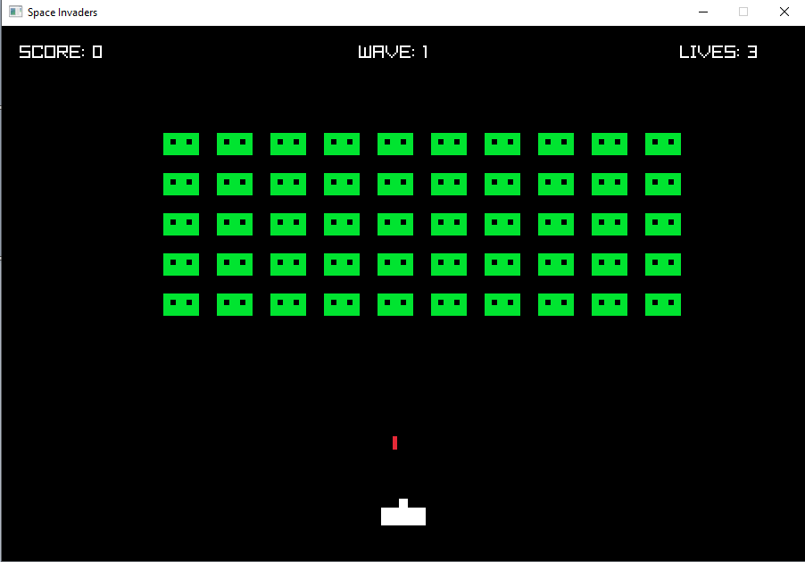
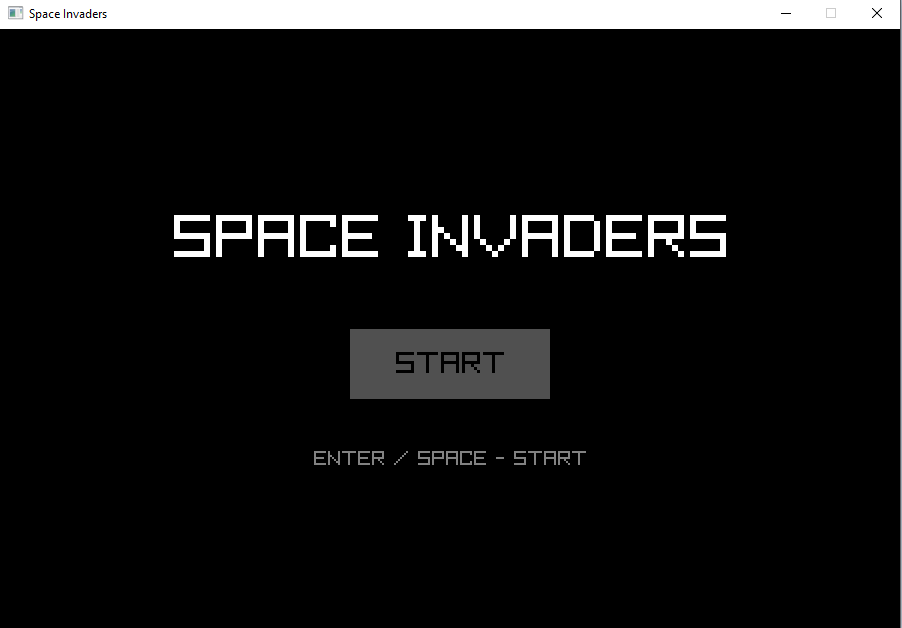
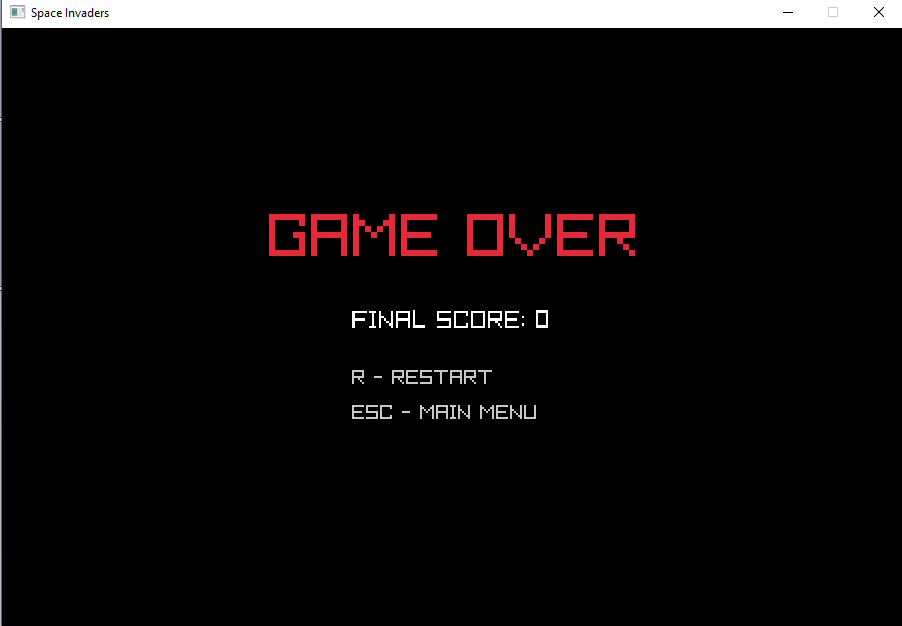
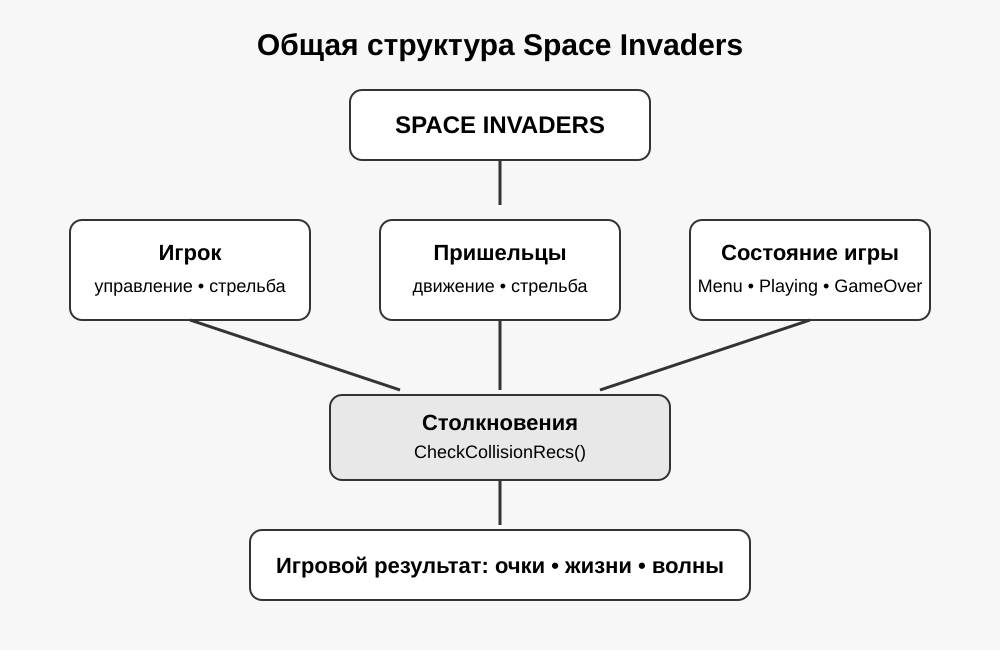
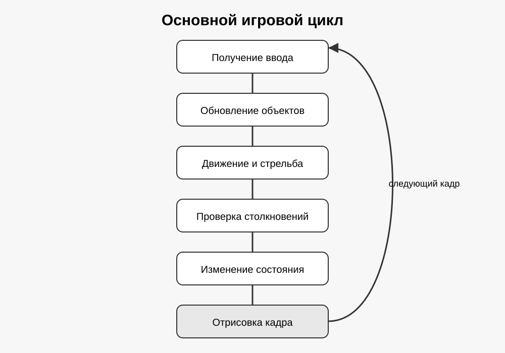
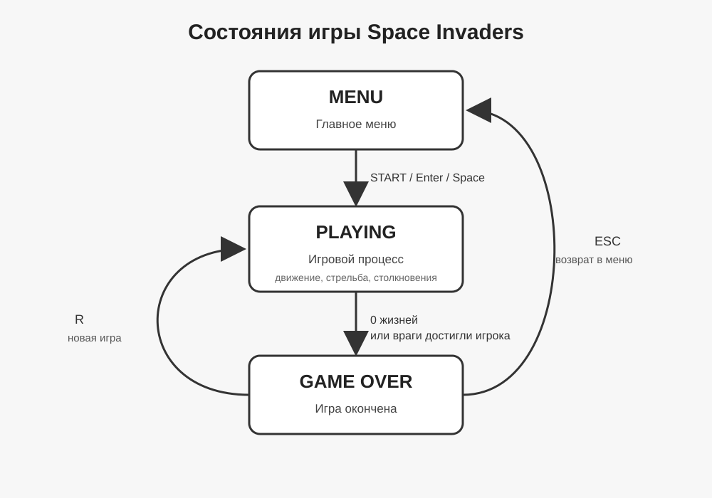
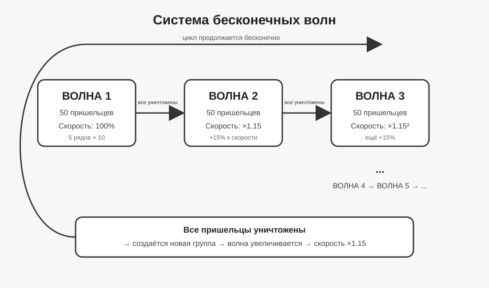

# Практическая часть: C++ Space Invaders

## 1. Общая информация о проекте

### Название

**Space Invaders — учебная 2D-игра на C++**

### Цель проекта

Целью практической части является изучение разработки простой 2D-игры на языке C++ на примере игры Space Invaders.

В ходе работы необходимо изучить основные элементы игрового цикла, обработку пользовательского ввода, движение игровых объектов, столкновения, стрельбу и изменение состояния игры.

В качестве основы для изучения использован учебный материал **Space Invaders from Scratch**, в котором рассматривается создание игры на C++ с использованием OpenGL, GLFW и GLEW.

Практическая реализация проекта выполнена самостоятельно с использованием библиотеки **raylib** и системы сборки **CMake**.

### Задачи

В рамках практической части были поставлены следующие задачи:

1. Изучить принцип работы простой игры Space Invaders.
2. Изучить основные элементы игрового цикла.
3. Реализовать управление игроком.
4. Реализовать движение пришельцев.
5. Реализовать стрельбу игрока.
6. Реализовать стрельбу пришельцев.
7. Реализовать столкновения пуль с игровыми объектами.
8. Реализовать систему трёх жизней игрока.
9. Реализовать экран Game Over и главное меню.
10. Реализовать систему волн противников.
11. Увеличивать скорость противников после прохождения каждой волны.
12. Подготовить документацию по созданному проекту.

## 2. Используемые технологии

| Технология         | Назначение                                                        |
| ------------------ | ----------------------------------------------------------------- |
| C++                | Основной язык программирования                                    |
| raylib             | Создание окна, отрисовка объектов, обработка ввода и столкновений |
| CMake              | Сборка проекта                                                    |
| Visual Studio 2022 | Компиляция и запуск проекта                                       |
| Git                | Контроль версий                                                   |
| GitHub             | Хранение репозитория и истории изменений                          |

## 3. Результат

В результате практической работы создана работающая 2D-игра Space Invaders.



**Рисунок 6 — Игровой процесс Space Invaders**

В игре реализованы главное меню, управление игроком, стрельба, противники, ответная стрельба противников, система трёх жизней, Game Over и последовательное прохождение волн.

После уничтожения всех противников создаётся новая волна, при этом скорость противников увеличивается. Это является дополнительной модификацией по сравнению с базовой реализацией.
## 4. Исследование исходного проекта

Для изучения принципов создания игры был выбран учебный материал **Space Invaders from Scratch**.

В исходном материале игра создаётся на языке C++ с использованием следующих технологий:

* C++;
* OpenGL;
* GLFW;
* GLEW.

Изучение материала позволило ознакомиться с основными этапами создания простой 2D-игры:

1. создание игрового окна;
2. запуск игрового цикла;
3. обработка пользовательского ввода;
4. создание и перемещение игровых объектов;
5. работа со спрайтами и текстурами;
6. управление игроком;
7. создание противников;
8. стрельба;
9. обработка столкновений;
10. отображение игровой информации.

Исходный учебный проект рассматривается в первую очередь как материал для изучения принципов разработки игры. Он не был полностью перенесён в готовом виде.

## 5. Выбор технологий для собственной реализации

Для практической реализации была выбрана библиотека **raylib**.

Причиной выбора является то, что raylib предоставляет готовые средства для создания окна, обработки клавиатуры, рисования игровых объектов и проверки столкновений. Это позволяет сосредоточиться на программировании игровой логики, не тратя большое количество времени на низкоуровневую настройку OpenGL.

В результате собственная реализация использует следующую схему:

```text
C++
 │
 ├── игровая логика
 ├── управление игроком
 ├── движение противников
 ├── стрельба
 ├── столкновения
 ├── жизни и Game Over
 └── система волн
        │
        ▼
      raylib
        │
        ├── окно игры
        ├── обработка клавиатуры
        ├── отрисовка
        └── проверка столкновений
```

Для сборки проекта используется **CMake**.

## 6. Отличия собственной реализации от исходного материала

Собственная версия игры не является точной копией исходного учебного проекта.

Основные отличия:

| Исходный материал                            | Собственная реализация             |
| -------------------------------------------- | ---------------------------------- |
| OpenGL                                       | raylib                             |
| GLFW и GLEW                                  | raylib                             |
| Учебная реализация отдельных игровых механик | Полностью собранная игровая версия |
| Базовая механика Space Invaders              | Расширенная игровая механика       |
| Ограниченная система игры                    | Главное меню и Game Over           |
| —                                            | Система трёх жизней                |
| —                                            | Стрельба пришельцев                |
| —                                            | Бесконечные волны                  |
| —                                            | Увеличение скорости противников    |

Таким образом, исходный проект использовался для изучения принципов создания игры, а программная реализация и дополнительные игровые механики были выполнены самостоятельно.

## 7. Структура проекта

Основная часть проекта имеет следующую структуру:

```text
space-invaders/
│
├── CMakeLists.txt
│
├── raylib/
│
├── src/
│   └── main.cpp
│
└── assets/
```

### Назначение файлов и папок

**`CMakeLists.txt`** — файл конфигурации сборки проекта.

**`src/main.cpp`** — основной исходный код игры. В нём находятся игровые состояния, игрок, противники, пули, обработка управления, столкновения и игровая логика.

**`raylib/`** — исходные файлы библиотеки raylib, используемой проектом.

**`assets/`** — папка для дополнительных ресурсов игры. В текущей версии основные игровые объекты рисуются непосредственно средствами raylib, поэтому отдельные изображения для них не используются.
## 8. Игровая логика

Игра построена на постоянном игровом цикле. На каждом кадре программа получает действия пользователя, изменяет положение игровых объектов, проверяет столкновения и затем отрисовывает новое состояние игры.

Общая схема работы:

```text
Запуск программы
       ↓
Главное меню
       ↓
     START
       ↓
Игровой цикл
       ↓
Обработка управления
       ↓
Движение объектов
       ↓
Стрельба
       ↓
Проверка столкновений
       ↓
Обновление очков и жизней
       ↓
Проверка окончания волны
       ↓
Отрисовка следующего кадра
       ↓
Повтор игрового цикла
```

### 8.1. Состояния игры

Для управления различными экранами используется перечисление `GameState`:

```cpp
enum class GameState
{
    Menu,
    Playing,
    GameOver
};
```

В игре существует три состояния:

* `Menu` — главное меню;
* `Playing` — непосредственно игровой процесс;
* `GameOver` — экран после проигрыша.

Текущее состояние хранится в переменной:

```cpp
GameState gameState = GameState::Menu;
```

При запуске игры устанавливается состояние `Menu`.

После нажатия `START` вызывается функция перезапуска игры и состояние меняется на `Playing`.

Если игрок теряет все жизни или пришельцы достигают его позиции, состояние меняется на `GameOver`.

Из состояния `GameOver` можно:

* нажать `R` и начать игру заново;
* нажать `ESC` и вернуться в главное меню.

### 8.2. Главное меню

При запуске программы отображается главное меню.

На экране находятся:

* название `SPACE INVADERS`;
* кнопка `START`;
* подсказка по управлению.

Запустить игру можно нажатием кнопки мышью либо клавишей `Enter` или `Space`.

Для того чтобы клавиша `ESC` использовалась самой игрой, автоматическое закрытие окна raylib отключено:

```cpp
SetExitKey(KEY_NULL);
```

После этого программа самостоятельно обрабатывает нажатие `ESC` и переводит игру из состояния `GameOver` в `Menu`.

### 8.3. Игрок

Игрок представлен прямоугольником:

```cpp
Rectangle player;
```

Его положение хранится в координатах `x` и `y`.

Игрок может двигаться влево и вправо.

Используются два варианта управления:

* `A` или `←` — движение влево;
* `D` или `→` — движение вправо.

Проверка выполняется с помощью:

```cpp
IsKeyDown(KEY_A)
IsKeyDown(KEY_LEFT)
IsKeyDown(KEY_D)
IsKeyDown(KEY_RIGHT)
```

Оператор `||` означает «или», поэтому движение происходит при нажатии любой из двух соответствующих клавиш.

Положение игрока изменяется с учётом времени кадра:

```cpp
player.x -= playerSpeed * deltaTime;
```

или:

```cpp
player.x += playerSpeed * deltaTime;
```

Игрок не может выйти за границы игрового окна.

### 8.4. Стрельба игрока

Для хранения пуль используется динамический массив:

```cpp
std::vector<Bullet> bullets;
```

Каждая пуля содержит прямоугольную область и скорость движения.

При нажатии `Space` создаётся новая пуля:

```cpp
if (IsKeyPressed(KEY_SPACE))
{
    Bullet bullet;

    bullet.rect = {
        player.x + player.width / 2.0f - 2.5f,
        player.y - 15.0f,
        5.0f,
        15.0f
    };

    bullet.speed = playerBulletSpeed;

    bullets.push_back(bullet);
}
```

Пуля движется вверх:

```cpp
bullet.rect.y -= bullet.speed * deltaTime;
```

Когда пуля выходит за пределы экрана, она удаляется из `vector`.

### 8.5. Пришельцы

В начале каждой волны создаётся группа из 50 пришельцев:

```text
5 рядов × 10 пришельцев = 50
```

Каждый пришелец представлен структурой:

```cpp
struct Alien
{
    Rectangle rect;
    bool alive;
};
```

`rect` определяет положение и размеры пришельца, а `alive` показывает, существует ли он в игре.

При попадании пули:

```cpp
alien.alive = false;
```

После этого пришелец перестаёт отображаться и учитываться как живой противник.

### 8.6. Движение пришельцев

Пришельцы двигаются группой влево или вправо.

Направление хранится в переменной:

```cpp
float alienDirection = 1.0f;
```

Положительное значение означает движение вправо, отрицательное — движение влево.

Когда группа достигает края игрового поля, направление меняется:

```cpp
alienDirection *= -1.0f;
```

После изменения направления все живые пришельцы опускаются вниз на 20 пикселей.

Таким образом получается классическая схема движения Space Invaders:

```text
→ → → → → →
          ↓
← ← ← ← ← ←
↓
→ → → → → →
```

### 8.7. Стрельба пришельцев

Для вражеских пуль используется отдельный `vector`:

```cpp
std::vector<EnemyBullet> enemyBullets;
```

Каждую секунду программа выбирает случайного живого пришельца.

Для генерации случайного выбора используются:

```cpp
std::srand(...)
std::rand()
```

Выбранный пришелец создаёт пулю, которая движется вниз:

```cpp
bullet.rect.y += bullet.speed * deltaTime;
```

Это позволяет сделать стрельбу противников непредсказуемой.

### 8.8. Столкновения

Для проверки столкновений используется функция raylib:

```cpp
CheckCollisionRecs()
```

Она позволяет определить пересечение двух прямоугольников.

Например, для проверки попадания пули игрока в пришельца используется:

```cpp
if (CheckCollisionRecs(
        bullet.rect,
        alien.rect))
{
    alien.alive = false;
    score += 10;
}
```

При попадании:

1. пришелец уничтожается;
2. пуля удаляется;
3. игрок получает 10 очков.

Также проверяется столкновение вражеской пули с игроком.

### 8.9. Система трёх жизней

В игре предусмотрено три жизни:

```cpp
const int maxLives = 3;
int lives = maxLives;
```

При попадании в игрока одна жизнь отнимается:

```cpp
lives--;
```

После попадания игрок возвращается в центр экрана.

Также на одну секунду включается защита от повторного попадания:

```cpp
invulnerabilityTimer =
    invulnerabilityDuration;
```

В это время игрок мигает и не может получить ещё один урон.

Когда количество жизней становится равно нулю:

```cpp
if (lives <= 0)
{
    gameState = GameState::GameOver;
}
```

игра переходит на экран `Game Over`.

### 8.10. Условие проигрыша

Проигрыш происходит в двух случаях:

1. игрок теряет все три жизни;
2. пришельцы опускаются до позиции игрока.

Во втором случае проверяется координата нижней части пришельца:

```cpp
if (alien.rect.y + alien.rect.height >= player.y)
{
    gameState = GameState::GameOver;
}
```

### 8.11. Система волн

После уничтожения всех пришельцев программа проверяет:

```cpp
bool allAliensDestroyed = true;
```

Если живых пришельцев не осталось, создаётся новая волна.

Номер волны увеличивается:

```cpp
wave++;
```

Также увеличивается скорость пришельцев:

```cpp
alienSpeed *= 1.15f;
```

Таким образом, каждая новая волна становится сложнее предыдущей.

При этом сохраняются:

* набранные очки;
* количество жизней;
* номер текущей волны.

После создания новой группы снова появляется 50 пришельцев.

В игре отсутствует конечный экран победы. После уничтожения всех противников начинается следующая волна, поэтому игра может продолжаться до тех пор, пока игрок не проиграет.

## 9. Управление

| Клавиша   | Действие                               |
| --------- | -------------------------------------- |
| `A` / `←` | Движение влево                         |
| `D` / `→` | Движение вправо                        |
| `Space`   | Стрельба                               |
| `Enter`   | Запуск игры из меню                    |
| `R`       | Перезапуск после проигрыша             |
| `ESC`     | Возврат в главное меню после проигрыша |

## 10. Основные игровые параметры

| Параметр                         |  Значение |
| -------------------------------- | --------: |
| Размер окна                      | 900 × 600 |
| Количество пришельцев в волне    |        50 |
| Количество рядов                 |         5 |
| Количество пришельцев в ряду     |        10 |
| Начальная скорость пришельцев    |        80 |
| Увеличение скорости каждой волны |       15% |
| Количество жизней                |         3 |
| Очки за уничтожение пришельца    |        10 |
| Интервал стрельбы пришельцев     | 1 секунда |
| Неуязвимость после попадания     | 1 секунда |
## 11. Сборка и запуск проекта

Для сборки проекта используется система **CMake**, а компиляция выполняется с помощью **Visual Studio 2022**.

### 11.1. Структура проекта

Перед сборкой проект имеет следующую структуру:

```text
space-invaders/
├── CMakeLists.txt
├── raylib/
├── src/
│   └── main.cpp
└── assets/
```

Основной файл программы находится в `src/main.cpp`.

Библиотека raylib находится в папке `raylib/` и подключается к проекту непосредственно через CMake.

### 11.2. Настройка проекта

Для настройки проекта используется **Developer Command Prompt for VS 2022**.

Сначала необходимо перейти в папку проекта:

```bat
cd C:\Projects\practice-project-a\space-invaders
```

После этого выполняется команда:

```bat
cmake -S . -B build -G "Visual Studio 17 2022" -A x64
```

В результате CMake создаёт папку `build` и генерирует файлы проекта для Visual Studio 2022.

### 11.3. Сборка проекта

После успешной настройки выполняется сборка:

```bat
cmake --build build --config Debug
```

Если сборка прошла успешно, исполняемый файл создаётся в папке:

```text
build/
└── Debug/
    └── SpaceInvaders.exe
```

### 11.4. Запуск игры

Для запуска программы используется команда:

```bat
build\Debug\SpaceInvaders.exe
```

После запуска открывается окно игры размером **900×600 пикселей**.

В главном меню отображается название игры и кнопка `START`.

### 11.5. Повторная сборка после изменения кода

Если файл `src/main.cpp` был изменён, повторно выполнять настройку CMake обычно не требуется.

Достаточно выполнить:

```bat
cmake --build build --config Debug
```

После успешной сборки игру можно снова запустить:

```bat
build\Debug\SpaceInvaders.exe
```

Таким образом, общий процесс работы выглядит следующим образом:

```text
Изменение main.cpp
       ↓
cmake --build build --config Debug
       ↓
SpaceInvaders.exe
       ↓
Запуск игры
       ↓
Проверка изменений
```
## 12. Пошаговая инструкция для начинающего

В данном разделе приведена последовательность действий, необходимая для получения, сборки и запуска проекта Space Invaders.

### 12.1. Подготовка инструментов

Для работы с проектом используются:

* Windows;
* Visual Studio 2022;
* CMake;
* Git;
* GitHub Desktop;
* библиотека raylib.

Visual Studio 2022 используется для компиляции программы, CMake — для настройки и сборки проекта, а Git и GitHub — для хранения и контроля версий исходного кода.

### 12.2. Получение проекта

После клонирования репозитория проект необходимо открыть в папке:

```text id="8f4j2p"
C:\Projects\practice-project-a
```

Практическая часть игры находится в папке:

```text id="7q1w8e"
C:\Projects\practice-project-a\space-invaders
```

Внутри неё находятся исходный код игры, файл CMake и исходные файлы библиотеки raylib.

### 12.3. Открытие Developer Command Prompt

Для сборки проекта используется **Developer Command Prompt for VS 2022**.

В данном терминале уже настроены необходимые инструменты Visual Studio для работы с компилятором MSVC.

После открытия терминала необходимо перейти в папку игры:

```bat id="p8z4mk"
cd C:\Projects\practice-project-a\space-invaders
```

### 12.4. Создание конфигурации CMake

Для создания файлов сборки используется команда:

```bat id="x4k2vn"
cmake -S . -B build -G "Visual Studio 17 2022" -A x64
```

Здесь:

* `-S .` указывает на текущую папку как на исходную;
* `-B build` указывает папку, в которой будут созданы файлы сборки;
* `-G "Visual Studio 17 2022"` выбирает генератор для Visual Studio 2022;
* `-A x64` указывает архитектуру 64-bit.

После выполнения команды появляется папка `build`.

### 12.5. Сборка программы

Для компиляции проекта используется:

```bat id="3t8vna"
cmake --build build --config Debug
```

CMake запускает необходимые инструменты Visual Studio и компилирует исходный код.

Если ошибок нет, сборка считается успешной.

Исполняемый файл находится по адресу:

```text id="w2c7rm"
build\Debug\SpaceInvaders.exe
```

### 12.6. Запуск игры

Запустить игру можно непосредственно из командной строки:

```bat id="e5y7qd"
build\Debug\SpaceInvaders.exe
```

После запуска появляется главное меню.



**Рисунок 5 — Главное меню игры**

Для начала игры необходимо нажать `Enter`, `Space` или кнопку `START`.

### 12.7. Проверка управления

После запуска игры необходимо проверить основные элементы управления:

| Действие                       | Клавиша     |
| ------------------------------ | ----------- |
| Движение влево                 | `A` или `←` |
| Движение вправо                | `D` или `→` |
| Выстрел                        | `Space`     |
| Возврат в меню после поражения | `Esc`       |
| Полный перезапуск игры         | `R`         |

Во время игры игрок управляет кораблём в нижней части экрана и уничтожает появляющихся противников.

### 12.8. Проверка игровой логики

После запуска необходимо проверить следующие функции:

1. Игрок перемещается по горизонтали.
2. Игрок не может выйти за границы игрового поля.
3. Нажатие `Space` создаёт пулю игрока.
4. Пуля движется вверх.
5. При попадании в пришельца он уничтожается.
6. За уничтожение пришельца увеличивается счёт.
7. Пришельцы двигаются по горизонтали.
8. При достижении границы они меняют направление и опускаются ниже.
9. Пришельцы периодически создают собственные пули.
10. Попадание в игрока уменьшает количество жизней.
11. После потери жизни игрок получает короткий период неуязвимости.
12. После потери всех трёх жизней появляется экран `GAME OVER`.
13. После уничтожения всех пришельцев начинается следующая волна.
14. С каждой новой волной скорость пришельцев увеличивается.

### 12.9. Изменение исходного кода

Основной код игры находится в файле:

```text id="m6z3pa"
src/main.cpp
```

Например, количество жизней задаётся переменной:

```cpp
int lives = 3;
```

Изменив значение на `5`, можно сделать пять жизней:

```cpp
int lives = 5;
```

После изменения кода необходимо снова выполнить сборку:

```bat id="v9q1ds"
cmake --build build --config Debug
```

Затем запустить обновлённую версию программы.

### 12.10. Типичный порядок работы

При разработке игры используется следующий цикл:

```text id="k3h8wa"
Изменить код
    ↓
Сохранить main.cpp
    ↓
Собрать проект через CMake
    ↓
Запустить SpaceInvaders.exe
    ↓
Проверить результат
    ↓
При необходимости исправить код
    ↓
Повторить цикл
```

Такой подход позволяет постепенно добавлять новые функции и проверять каждое изменение отдельно.
## 13. Примеры основных фрагментов кода

В данном разделе рассмотрены основные фрагменты исходного кода проекта. Они показывают, как реализованы управление игроком, стрельба, движение противников, столкновения, система жизней и переход между волнами.

### 13.1. Управление игроком

Для хранения положения игрока используется прямоугольник `Rectangle`. В игровом цикле постоянно проверяется состояние клавиш.

```cpp
if (IsKeyDown(KEY_A) || IsKeyDown(KEY_LEFT))
{
    player.x -= playerSpeed * GetFrameTime();
}

if (IsKeyDown(KEY_D) || IsKeyDown(KEY_RIGHT))
{
    player.x += playerSpeed * GetFrameTime();
}
```

`IsKeyDown()` проверяет, удерживается ли клавиша в данный момент.

`GetFrameTime()` возвращает время, прошедшее с предыдущего кадра. Благодаря этому скорость движения не зависит напрямую от количества кадров в секунду.

После перемещения положение игрока ограничивается границами игрового окна:

```cpp
if (player.x < 0)
    player.x = 0;

if (player.x + player.width > WINDOW_WIDTH)
    player.x = WINDOW_WIDTH - player.width;
```

Таким образом, корабль не может выйти за пределы игрового поля.

### 13.2. Создание пули игрока

Для хранения пуль используется динамический массив `std::vector`.

```cpp
std::vector<Bullet> bullets;
```

При нажатии клавиши `Space` создаётся новая пуля:

```cpp
if (IsKeyPressed(KEY_SPACE))
{
    Bullet bullet;
    bullet.rect = {
        player.x + player.width / 2 - 2,
        player.y - 10,
        4,
        10
    };

    bullet.active = true;
    bullets.push_back(bullet);
}
```

Новая пуля добавляется в конец `vector`.

После этого в каждом кадре её координата по вертикали уменьшается:

```cpp
for (auto& bullet : bullets)
{
    if (bullet.active)
        bullet.rect.y -= bulletSpeed * GetFrameTime();
}
```

Так реализуется движение пули вверх.

### 13.3. Движение пришельцев

Пришельцы хранятся в массиве объектов `Alien`.

В проекте создаётся несколько рядов противников:

```cpp
for (int row = 0; row < 5; row++)
{
    for (int col = 0; col < 10; col++)
    {
        Alien alien;
        alien.rect = {
            100 + col * 65,
            80 + row * 45,
            40,
            25
        };

        alien.alive = true;
        aliens.push_back(alien);
    }
}
```

В результате создаётся 5 рядов по 10 пришельцев, то есть всего 50 противников.

Для движения используется общая скорость:

```cpp
alien.x += alienSpeed * alienDirection * GetFrameTime();
```

`alienDirection` определяет направление движения:

* `1` — движение вправо;
* `-1` — движение влево.

При достижении границы направление изменяется:

```cpp
if (rightEdge || leftEdge)
{
    alienDirection *= -1;

    for (auto& alien : aliens)
    {
        if (alien.alive)
            alien.rect.y += 20;
    }
}
```

После смены направления вся группа также опускается на несколько пикселей.

### 13.4. Проверка столкновений

Для проверки столкновений используется функция `CheckCollisionRecs()` библиотеки raylib.

Например, столкновение пули игрока с пришельцем проверяется следующим образом:

```cpp
if (CheckCollisionRecs(bullet.rect, alien.rect))
{
    bullet.active = false;
    alien.alive = false;
    score += 10;
}
```

Если прямоугольники пересекаются:

1. пуля становится неактивной;
2. пришелец уничтожается;
3. игрок получает 10 очков.

Такой способ позволяет достаточно просто реализовать столкновения для объектов игры.

### 13.5. Система жизней

В начале игры игрок получает три жизни:

```cpp
int lives = 3;
```

При попадании в игрока количество жизней уменьшается:

```cpp
lives--;

player.x = WINDOW_WIDTH / 2 - player.width / 2;
```

После потери жизни игрок возвращается в исходное положение.

Если количество жизней становится равно нулю, состояние игры изменяется:

```cpp
if (lives <= 0)
{
    gameState = GameState::GameOver;
}
```

Таким образом, используется перечисление состояний игры:

```cpp
enum class GameState
{
    Menu,
    Playing,
    GameOver
};
```

Переменная `gameState` определяет, какой экран и какую игровую логику необходимо выполнять.

### 13.6. Переход между волнами

После уничтожения всех пришельцев создаётся новая волна.

Сначала проверяется, остался ли хотя бы один живой противник:

```cpp
bool anyAlive = false;

for (const auto& alien : aliens)
{
    if (alien.alive)
    {
        anyAlive = true;
        break;
    }
}
```

Если живых противников больше нет, увеличивается номер волны:

```cpp
if (!anyAlive)
{
    wave++;
    CreateAliens();
    alienSpeed *= 1.15f;
}
```

При этом:

* номер волны увеличивается на 1;
* создаётся новая группа противников;
* скорость пришельцев увеличивается на 15%;
* набранный счёт сохраняется.

Таким образом, игра не заканчивается после уничтожения одной группы противников и постепенно становится сложнее.

### 13.7. Главный игровой цикл

Основой программы является игровой цикл:

```cpp
while (!WindowShouldClose())
{
    // Обработка ввода
    // Обновление объектов
    // Проверка столкновений
    // Отрисовка игры
}
```

Цикл выполняется до тех пор, пока пользователь не закроет окно.

Внутри него последовательно выполняются основные операции игры:

```text
Получение ввода
      ↓
Изменение положения объектов
      ↓
Создание и движение пуль
      ↓
Проверка столкновений
      ↓
Изменение игрового состояния
      ↓
Отрисовка кадра
      ↓
Следующий кадр
```

Игровой цикл является основной частью программы, так как именно он обеспечивает постоянное обновление состояния игры и её отображение на экране.
## 14. Тестирование проекта

После реализации основных функций была проведена проверка работы игры. Тестирование выполнялось вручную путем запуска программы и выполнения действий пользователя.

Цель тестирования — убедиться, что основные игровые механики работают корректно и ошибки не препятствуют прохождению игры.

### 14.1. Функциональное тестирование

| №  | Что проверяется      | Действие                            | Ожидаемый результат                                | Результат |
| -- | -------------------- | ----------------------------------- | -------------------------------------------------- | --------- |
| 1  | Запуск игры          | Запустить `SpaceInvaders.exe`       | Открывается главное меню                           | Пройдено  |
| 2  | Начало игры          | Нажать `Enter`, `Space` или `START` | Открывается игровой экран                          | Пройдено  |
| 3  | Движение влево       | Нажать `A` или `←`                  | Игрок движется влево                               | Пройдено  |
| 4  | Движение вправо      | Нажать `D` или `→`                  | Игрок движется вправо                              | Пройдено  |
| 5  | Границы поля         | Двигаться к краю экрана             | Игрок не выходит за границу                        | Пройдено  |
| 6  | Стрельба игрока      | Нажать `Space`                      | Создаётся пуля                                     | Пройдено  |
| 7  | Попадание            | Попасть пулей в пришельца           | Пришелец уничтожается                              | Пройдено  |
| 8  | Начисление очков     | Уничтожить пришельца                | Счёт увеличивается на 10                           | Пройдено  |
| 9  | Движение пришельцев  | Наблюдать за группой                | Пришельцы двигаются и меняют направление у границы | Пройдено  |
| 10 | Стрельба пришельцев  | Продолжать игру                     | Противники периодически создают пули               | Пройдено  |
| 11 | Потеря жизни         | Получить попадание                  | Количество жизней уменьшается                      | Пройдено  |
| 12 | Неуязвимость         | Получить попадание                  | Игрок некоторое время не получает повторный урон   | Пройдено  |
| 13 | Game Over            | Потерять все жизни                  | Появляется экран `GAME OVER`                       | Пройдено  |
| 14 | Перезапуск           | На экране Game Over нажать `R`      | Игра начинается заново                             | Пройдено  |
| 15 | Возврат в меню       | На Game Over нажать `Esc`           | Открывается главное меню                           | Пройдено  |
| 16 | Новая волна          | Уничтожить всех пришельцев          | Создаётся новая группа противников                 | Пройдено  |
| 17 | Увеличение сложности | Перейти на новую волну              | Скорость пришельцев увеличивается                  | Пройдено  |

### 14.2. Проверка сборки

Дополнительно проверялась возможность повторной сборки проекта после изменения исходного кода.

Для сборки использовалась команда:

```bat id="x5gq1z"
cmake --build build --config Debug
```

Сборка завершалась без ошибок, после чего запускался полученный исполняемый файл:

```bat id="f4zv8n"
build\Debug\SpaceInvaders.exe
```

### 14.3. Проверка основных игровых состояний

В игре предусмотрены три основных состояния:

```text id="v1q7hs"
Menu
  ↓
Playing
  ↓
GameOver
  ↓
Menu
```

В состоянии `Menu` отображается главное меню.

В состоянии `Playing` выполняется основная игровая логика: движение игрока и пришельцев, стрельба, столкновения и подсчёт очков.

В состоянии `GameOver` игра останавливается и пользователю предлагается начать игру заново или вернуться в главное меню.

### 14.4. Результаты тестирования

В результате проведённого тестирования основные функции проекта работают корректно.

Проверены:

* запуск и завершение программы;
* главное меню;
* управление игроком;
* стрельба игрока;
* движение пришельцев;
* стрельба противников;
* столкновения;
* система жизней;
* Game Over;
* перезапуск игры;
* переход между волнами;
* увеличение сложности.

Критических ошибок, препятствующих запуску и прохождению игры, в ходе проверки не обнаружено.
## 15. Дополнительная модификация проекта

В рамках практической работы была выполнена собственная модификация базовой концепции Space Invaders. Цель модификации — сделать игровой процесс более полноценным и добавить возможность продолжать игру после уничтожения первой группы противников.

### 15.1. Добавленные функции

В собственной реализации были добавлены следующие элементы:

1. Главное меню игры.
2. Система трёх жизней игрока.
3. Ответная стрельба пришельцев.
4. Короткий период неуязвимости после попадания.
5. Экран `GAME OVER`.
6. Возможность перезапуска игры.
7. Возврат из Game Over в главное меню.
8. Система последовательных волн противников.
9. Увеличение скорости противников после каждой волны.

### 15.2. Система волн

Одной из основных модификаций стала система волн противников.

В начале игры создаётся первая группа из 50 пришельцев. После уничтожения всех противников создаётся новая группа.

Номер текущей волны хранится в переменной:

```cpp id="0l6b4h"
int wave = 1;
```

После уничтожения всех пришельцев номер волны увеличивается:

```cpp id="a8m3kq"
wave++;
CreateAliens();
alienSpeed *= 1.15f;
```

При этом скорость движения противников увеличивается на 15 процентов.

Таким образом, каждая следующая волна становится сложнее предыдущей.

### 15.3. Система жизней

В качестве дополнительной игровой механики была реализована система трёх жизней.

```cpp id="q7v2cx"
int lives = 3;
```

При попадании в игрока одна жизнь отнимается. После потери жизни игрок возвращается в исходное положение.

Для предотвращения нескольких мгновенных попаданий подряд используется короткий период неуязвимости. Во время него игрок также визуально мигает.

Если все жизни потеряны, состояние игры изменяется на `GameOver`.



**Рисунок 7 — Экран окончания игры**

### 15.4. Стрельба противников

В базовой игровой логике игрок может уничтожать противников своими выстрелами. В собственной версии также была добавлена ответная стрельба пришельцев.

Через определённый промежуток времени выбирается случайный живой противник, после чего создаётся его пуля.

Для выбора случайного объекта используется генератор псевдослучайных чисел:

```cpp id="x1c5dz"
int index = std::rand() % aliens.size();
```

Перед началом игры генератор инициализируется:

```cpp id="h9r4wp"
std::srand(static_cast<unsigned int>(std::time(nullptr)));
```

Благодаря этому выбор стреляющего пришельца изменяется между запусками игры.

### 15.5. Главное меню и состояния игры

Также было добавлено главное меню.

Для управления различными экранами используется перечисление:

```cpp id="v8n2jm"
enum class GameState
{
    Menu,
    Playing,
    GameOver
};
```

Это позволяет разделить программу на три основных состояния:

```text id="s3c7mw"
Главное меню
     ↓
   Игра
     ↓
 Game Over
   ↙     ↘
Меню    Рестарт
```

Для выхода из меню используется `Enter`, `Space` или нажатие кнопки `START`.

### 15.6. Результат модификации

В результате модификации базовая игра была дополнена игровым циклом с постепенным увеличением сложности.

Игрок может:

* начать игру из главного меню;
* уничтожать противников;
* получать очки;
* терять и сохранять жизни;
* переживать несколько волн;
* сталкиваться с увеличением скорости противников;
* проиграть после потери всех жизней;
* начать новую игру или вернуться в меню.

Таким образом, модификация превратила первоначальную демонстрационную реализацию основных механик Space Invaders в более завершённую игровую версию с системой прогрессии и усложнения.

## 16. Иллюстрации и схемы

В данном разделе представлены основные схемы, отражающие архитектуру проекта, игровой цикл, состояния игры и работу системы волн.

### 16.1. Архитектура проекта

Схема показывает основные части программы и их взаимодействие.



### 16.2. Основной игровой цикл

Игровой цикл выполняется непрерывно во время игрового процесса. На каждом кадре программа получает ввод пользователя, обновляет игровые объекты, проверяет столкновения и выполняет отрисовку.



### 16.3. Состояния игры

В программе используются три основных состояния: главное меню, игровой процесс и экран окончания игры.



### 16.4. Система бесконечных волн

После уничтожения всех пришельцев создаётся новая волна. Количество пришельцев сохраняется равным 50, а скорость их движения увеличивается на 15% относительно предыдущей волны.



### 16.5. Игровые объекты

| Объект | Назначение |
|---|---|
| Игрок | Управляется пользователем и перемещается по нижней части экрана |
| Пришельцы | Двигаются группой и постепенно опускаются вниз |
| Пуля игрока | Двигается вверх и уничтожает пришельцев |
| Пуля противника | Двигается вниз и может отнять жизнь игрока |
| Волна | Группа из 50 пришельцев |
| GameState | Определяет текущее состояние игры |
